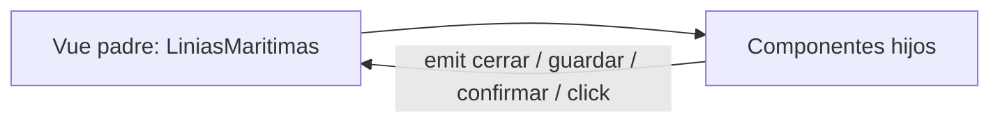

# Explicación del flujo entre componentes en `LiniasMaritimas.vue`

Este documento explica solo cómo se pasan los datos entre el componente padre `LiniasMaritimas.vue` y sus hijos. La idea central es que el padre guarda el estado, los hijos reciben props y devuelven acciones con emits.

## 1. Flujo general de datos

La idea es siempre la misma:

1. La página padre guarda el estado.
2. Los hijos reciben props.
3. Los hijos notifican acciones con emits.
4. El padre decide cuándo llamar al composable o al backend.
5. El resultado vuelve al padre.
6. El padre refresca la tabla o cierra modales.

## 2. La página padre: `LiniasMaritimas.vue`

La pantalla principal es `LiniasMaritimas.vue`. Esa página hace tres cosas:

- carga datos al montar
- muestra la tabla de líneas marítimas
- controla dos modales: crear/editar y eliminar

### Estado que vive en el padre

La página mantiene este estado:

- `linias`, `ports`, `ciutats`
- `cargando` y `apiError`
- `mostrarModalFormulario` y `mostrarModalEliminar`
- `editando`, `liniaEnEdicion` y `liniaAEliminar`

Eso significa que la pantalla padre es la única que decide qué línea se edita, cuál se borra y cuándo se refresca el listado.

## 3. El composable como capa intermedia

La lógica HTTP no está escrita directamente en la vista, sino en `useLiniaTransportMaritim()`.

Ese composable centraliza:

- `cargarLinias()` -> `GET /linias-maritimas`
- `cargarPorts()` -> `GET /port`
- `cargarCiudades()` -> `GET /ciutats`
- `guardarLinia()` -> `POST /linias-maritimas` o `PUT /linias-maritimas/{id}`
- `eliminarLinia()` -> `DELETE /linias-maritimas/{id}`

La ventaja es que la página no necesita conocer los detalles de cada request; solo invoca funciones del composable.

## 4. Componentes hijos y comunicación

### `FormularioLinia.vue`

Es el hijo que gestiona crear o editar una línea.

Recibe props desde el padre:

- `mostrarModal`
- `editando`
- `liniaEnEdicion`
- `ports`
- `ciutats`

Emite eventos hacia arriba:

- `cerrar` para cerrar el modal
- `guardar` para enviar el formulario al padre

Aquí se ve el patrón clásico de datos:

- el padre envía la lista de puertos y ciudades
- el hijo construye un formulario local
- el hijo devuelve el formulario completo al padre al guardar

### `ModalEliminar.vue`

Es el hijo de confirmación para borrar una línea.

Recibe:

- `mostrar`

Emite:

- `cerrar`
- `confirmar`

Aquí el hijo no borra por sí mismo. Solo pregunta y avisa. El padre sigue siendo el que ejecuta la operación real.

### `BtnEditar.vue` y `BtnEliminar.vue`

Son botones muy pequeños de presentación.

Ambos solo emiten `click`.

El padre los usa dentro de la tabla para abrir el modal correcto:

- editar -> abre el formulario con la línea seleccionada
- eliminar -> abre el modal de confirmación

## 5. Props y emits, explicado simple

### Props: de padre a hijo

El padre manda datos al hijo.

Ejemplos reales:

- `:mostrarModal="mostrarModalFormulario"`
- `:editando="editando"`
- `:ports="ports"`
- `:ciutats="ciutats"`

Eso sirve para que el hijo se pinte con la información que ya decidió el padre.

### Emits: de hijo a padre

El hijo devuelve eventos al padre.

Ejemplos reales:

- `@cerrar="cerrarModalFormulario"`
- `@guardar="guardarLinia"`
- `@confirmar="confirmarEliminar"`
- `@click="abrirModalEditar(linia)"`

El hijo no cambia por sí mismo el estado global; solo dispara la acción y el padre la resuelve.

## 6. Qué hay dentro de `BtnEliminar.vue` y `FormularioLinia.vue`

### `BtnEliminar.vue`

Contenido del componente:

- **Template**: un botón con icono SVG de papelera y evento `@click="$emit('click')"`.
- **Script**: solo define `defineEmits(['click'])`.
- **Style**: estilos visuales del botón (color rojo, hover más oscuro y pequeño efecto de escala).

Qué significa esto en la práctica:

- `BtnEliminar.vue` no conoce ids ni backend.
- Solo emite una intención de acción (`click`).
- El padre decide qué hacer al recibir ese evento.

### `FormularioLinia.vue`

Contenido del componente:

- **Template**:
    - modal condicional con `v-if="mostrarModal"`
    - campo `nom` (texto)
    - selector de `ciutat_id`
    - checklist de `ports`
    - botones de cancelar y crear/actualizar
    - validación visual cuando no hay puertos seleccionados
- **Script**:
    - `defineProps` para `mostrarModal`, `editando`, `liniaEnEdicion`, `ports`, `ciutats`
    - `defineEmits(['cerrar', 'guardar'])`
    - estado local `formulario`, `guardando`, `errorFormulario`
    - watcher de `mostrarModal` para inicializar formulario en modo crear o editar
    - `manejarEnvio()` que valida puertos y emite `guardar` con el formulario
- **Style**:
    - estilos del overlay/modal
    - estilos de inputs, grid de puertos y estados hover/focus
    - estilos de botones y spinner de guardado

Qué significa esto en la práctica:

- el padre controla cuándo abrir/cerrar el modal
- el hijo controla la edición del formulario local
- el hijo entrega datos limpios al padre mediante `emit('guardar', formulario)`

## 7. Cómo se vincula el click de Crear con la apertura del formulario

Este es el circuito exacto cuando haces click en `+ Agregar Línia`:

1. En `LiniasMaritimas.vue` el botón tiene `@click="abrirModalCrear"`.
2. `abrirModalCrear()` pone:
    - `editando = false`
    - `liniaEnEdicion = null`
    - `mostrarModalFormulario = true`
3. Ese estado se pasa al hijo por props:
    - `:mostrarModal="mostrarModalFormulario"`
    - `:editando="editando"`
    - `:linia-en-edicion="liniaEnEdicion"`
4. En `FormularioLinia.vue`, como `mostrarModal` es `true`, se renderiza el modal (`v-if="mostrarModal"`).
5. El watcher del hijo detecta que el modal se abrió y prepara el formulario en modo crear (vacío).

Resultado: el click no abre el modal directamente. El click cambia estado en el padre y ese estado abre el hijo vía props.

## 8. Cómo se vincula el click de Editar

Flujo de edición:

1. En la tabla, `BtnEditar` emite `click`.
2. El padre escucha `@click="abrirModalEditar(linia)"`.
3. `abrirModalEditar(linia)` pone:
    - `editando = true`
    - `liniaEnEdicion = linia`
    - `mostrarModalFormulario = true`
4. El hijo recibe props actualizadas y, en su watcher, rellena el formulario con `liniaEnEdicion`.

Resultado: el mismo componente `FormularioLinia.vue` sirve para crear y editar, según el estado que el padre le envía.

## 9. Cómo se vincula el click de Eliminar

Flujo de eliminación:

1. En la tabla, `BtnEliminar` emite `click`.
2. El padre escucha `@click="abrirModalEliminar(linia.id)"`.
3. `abrirModalEliminar(id)` guarda `liniaAEliminar` y activa `mostrarModalEliminar = true`.
4. `ModalEliminar.vue` se abre por la prop `:mostrar="mostrarModalEliminar"`.
5. Si confirmas, el hijo emite `confirmar` y el padre ejecuta `confirmarEliminar()`.

## 10. Qué pasa al guardar una línea

Cuando el usuario crea o edita una línea:

1. `FormularioLinia.vue` reúne `nom`, `ciutat_id` y `ports`.
2. Emite `guardar` con el formulario.
3. `LiniasMaritimas.vue` recibe ese evento.
4. Llama a `guardarLinia()` del composable.
5. El composable hace `POST` o `PUT` al backend.
6. El controlador persiste la información y sincroniza la tabla pivote de puertos.
7. El composable recarga el listado.
8. El padre cierra el modal si todo salió bien.

## 11. Qué pasa al eliminar una línea

El borrado sigue la misma idea:

1. `BtnEliminar` abre el modal de confirmación.
2. `ModalEliminar.vue` emite `confirmar`.
3. La página llama a `eliminarLinia()`.
4. El backend ejecuta `DELETE /linias-maritimas/{id}`.
5. El controlador elimina la línea y desacopla sus puertos.
6. El listado se refresca.

## 12. Conclusión

En `LiniasMaritimas.vue` el patrón es bastante claro:

- el padre controla el estado y la lógica de pantalla
- los hijos reciben datos por props
- los hijos devuelven eventos por emits
- el composable intermedia las llamadas al backend

Si quieres, el siguiente paso puede ser convertir esto en una versión más corta para documentación interna o en una versión técnica con ejemplos de código por componente.
